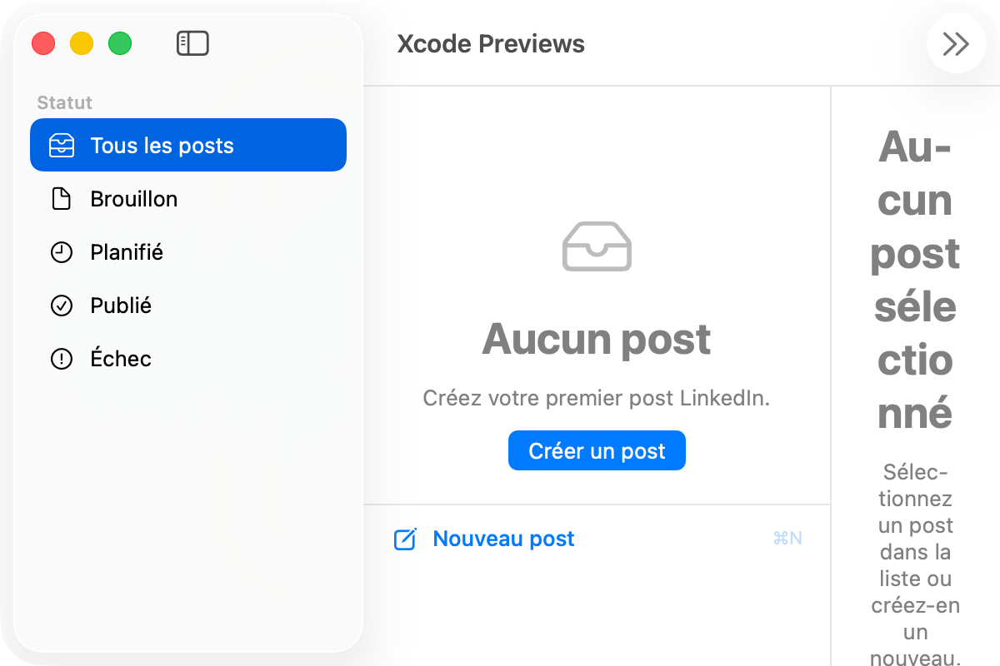
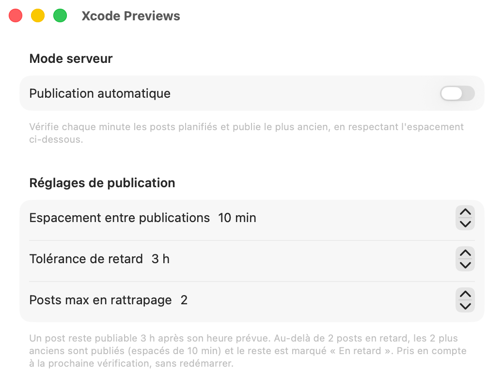
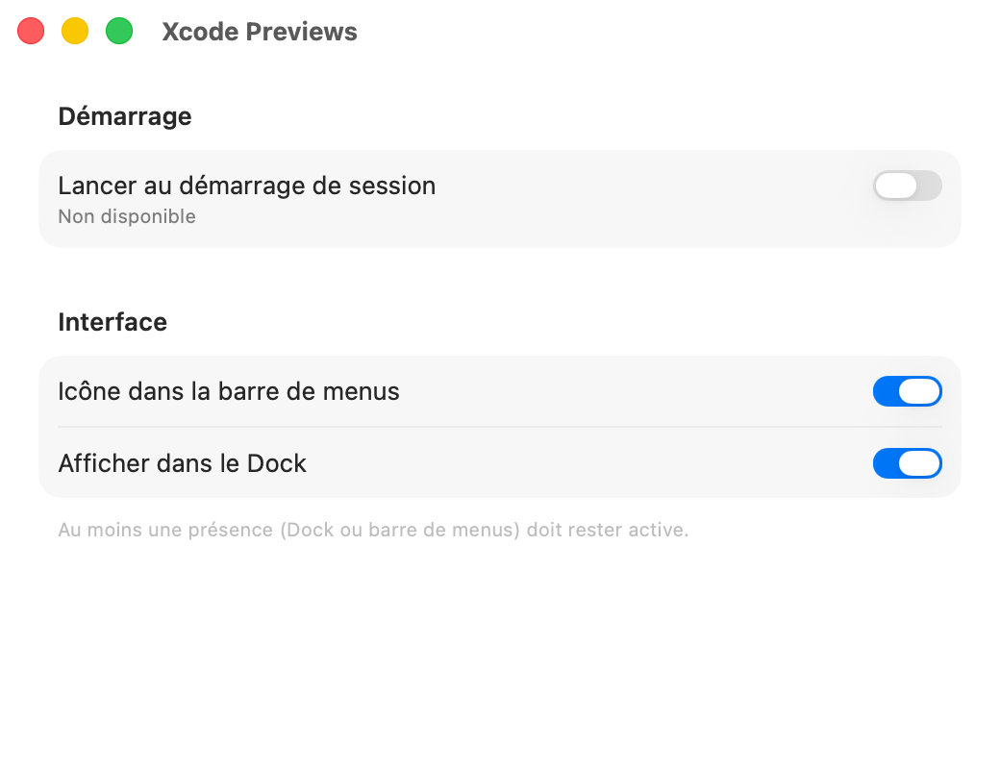

## Rédiger et publier

L’éditeur réunit tout ce dont un post a besoin : un **titre interne**, le **texte** (jusqu’à 3 000 caractères), des **tags**, un **média** (une image ou un document PDF) et une **date de programmation**. Un aperçu vous permet de vérifier le rendu avant d’enregistrer.

Les actions proposées s’adaptent à l’état du contenu :

- un nouveau contenu peut rester en brouillon, être programmé ou être publié immédiatement ;
- un contenu planifié peut être modifié, publié tout de suite ou dupliqué ;
- un contenu déjà publié peut être copié puis republié.

> Le titre et les tags servent uniquement à vous organiser : ils ne sont jamais ajoutés au texte envoyé à LinkedIn.

LinkedIn reçoit au choix du texte seul, du texte avec une image, ou un document PDF.

## Organiser sa ligne éditoriale

La barre latérale affiche le nombre de publications par statut et la liste de vos tags.

- La **vue Liste** sert au suivi éditorial au quotidien.
- La **vue Agenda** place vos publications planifiées ou publiées dans un calendrier mensuel. Un clic sur une journée ouvre une chronologie heure par heure, d’où vous pouvez créer un post directement sur un créneau libre.

| État | Signification |
| --- | --- |
| Brouillon | Contenu enregistré, ni programmé ni publié. |
| Planifié | En attente de publication à une date donnée. |
| Publié | Publication acceptée par LinkedIn. |
| Échec | La publication n’a pas abouti ou a été écartée par le rattrapage. |

Les erreurs restent visibles avec leur message. Les contenus trop anciens, écartés par le rattrapage automatique, portent la mention « En retard ».

## Publication automatique

Le mode serveur vérifie chaque minute les publications arrivées à échéance et publie d’abord la plus ancienne. Trois réglages vous laissent maîtriser le rythme :

- l’**espacement minimal** entre deux publications ;
- la **tolérance de retard** ;
- le **nombre maximal** de publications à rattraper.

Pour que l’automatisation fonctionne, le Mac doit rester allumé, l’application lancée, le compte LinkedIn connecté et la synchronisation active.

## Intégration à macOS

LinkedinPostManager peut se lancer à l’ouverture de session et rester accessible depuis le Dock, la barre des menus, ou les deux. L’application refuse de masquer ces deux accès à la fois, pour que vous puissiez toujours l’ouvrir.

Le menu de la barre des menus résume les publications du jour, signale les contenus en retard et ouvre la fenêtre principale ou les réglages.

## Connexion à LinkedIn

La connexion passe par **OAuth**. Vous renseignez le Client ID et le Client Secret de votre application LinkedIn dans **Réglages > LinkedIn**. Ils sont conservés dans le Trousseau macOS. L’écran affiche aussi l’URI de redirection à déclarer dans LinkedIn Developers.

## Stockage et synchronisation iCloud

Vos publications et vos tags sont synchronisés via iCloud (CloudKit), avec un cache local. Les images et les PDF ont leur propre stockage. Si CloudKit est indisponible, l’application bascule sur un stockage local de secours, isolé, pour ne jamais faire passer des données locales pour synchronisées.

L’onglet **Cloud** des réglages affiche le compte iCloud, l’environnement CloudKit, le stockage réellement utilisé, le nombre de publications chargées et les événements de synchronisation. Des outils avancés permettent d’exporter ou d’importer une archive de migration.

## Confidentialité

- Les identifiants OAuth sont enregistrés dans le Trousseau macOS.
- Les données CloudKit sont placées dans la base **privée** iCloud de l’utilisateur.

---

Envie d’essayer ? [Rejoignez la bêta TestFlight →](/beta)

<small>Les captures proviennent des aperçus SwiftUI de l’application : elles peuvent contenir des données de démonstration et différer légèrement de la version en cours.</small>
